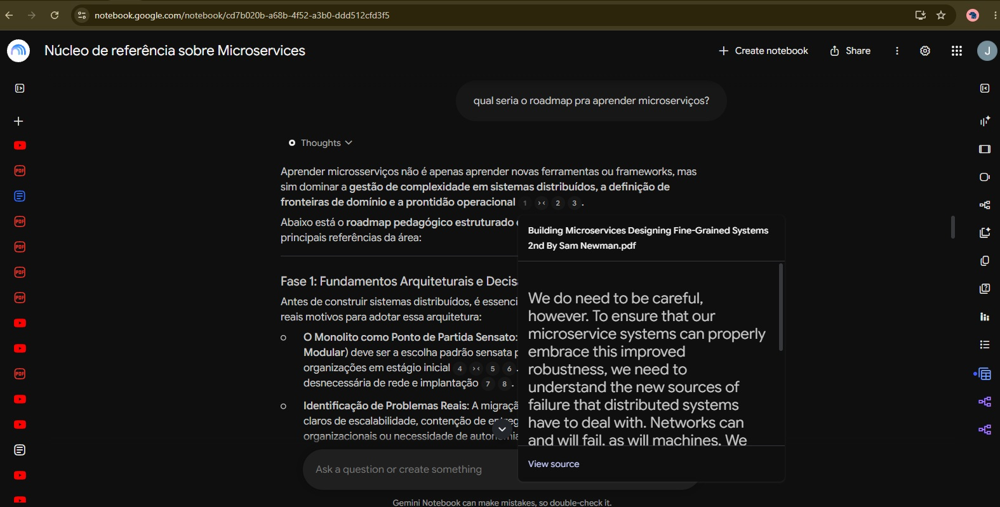
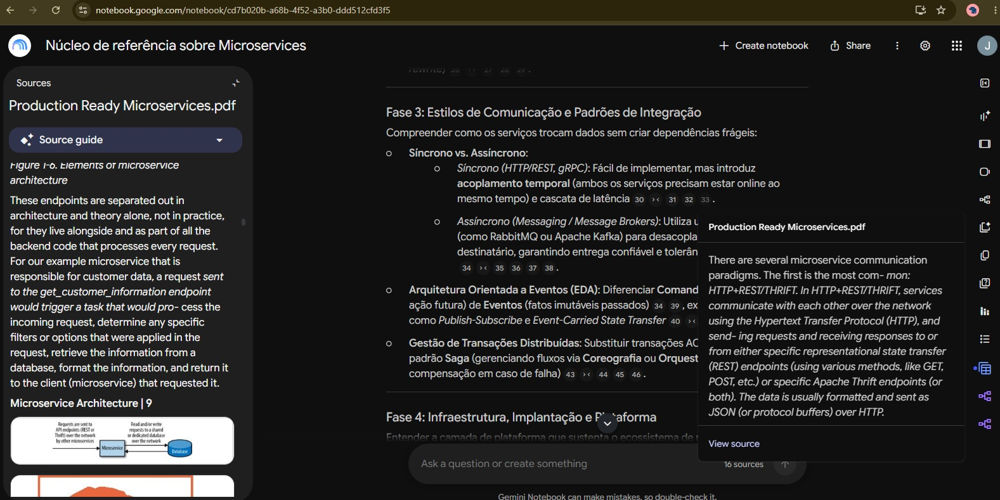
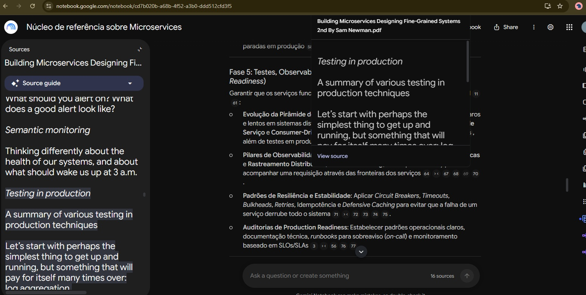

# **(Atividade 1) Lab Project - Treinando uma IA de Aprendizagem - Explore o Poder do NotebookLM** 

[Link para o notebook](https://notebook.google.com/notebook/cd7b020b-a68b-4f52-a3b0-ddd512cfd3f5) 

# **TEMA/OBJETIVO:** 
Criar um núcleo de referência sobre nichos específicos de arquitetura de software: Event Driven Architecture, Microservices, Messaging e afins. 

# **FONTES - VIDEOS:** 
- https://www.youtube.com/watch?v=1O2LkhlKO5Q 
- https://www.youtube.com/watch?v=hrvx8Nv9eQA 
- https://www.youtube.com/watch?v=C842vFY5kRo 
- https://www.youtube.com/watch?v=7YmLbhiK-PM 
- https://www.youtube.com/watch?v=lEcULR30-GM 
- https://www.youtube.com/watch?v=yxeMFqIAOwg 
- https://www.youtube.com/watch?v=DOaDpHh1FsQ 
- https://www.youtube.com/watch?v=vRyKe6Ya0dI  

# **FONTES - PDF:** 
- [Building Microservices - Designing Fine-Grained Systems - Sam Newman](https://github.com/themockingjester/Books/blob/master/Building%20Microservices%2C%202nd%20Edition.pdf) 
- [Clean Architecture - Robert C. Martin](https://github.com/ivanarandac/Books/blob/master/Clean%20Architecture%20A%20Craftsman%20Guide%20to%20Software%20Structure%20and%20Design.pdf) 
- [Designing Event-Driven Systems - Ben Stopford](https://github.com/sovansela/books-lib/blob/main/confluent-designing-event-driven-systems.pdf) 
- [Designing Data-Intensive Applications - Martin Kleppmann](https://github.com/sovansela/books-lib/blob/main/Designing%20Data%20Intensive%20Applications%20-%20Martin%20Kleppmann.pdf) 
- [Production-Ready Microservices - Susan J. Fowler](https://github.com/ivanarandac/Books/blob/master/Production%20Ready%20Microservices.pdf)  

# **DIRETRIZ DE COMPORTAMENTO:** 
Se comporte como um experiente professor de arquitetura e engenharia de software.  

# **PERGUNTAS REALIZADAS:** 
**Pergunta 1: qual seria o roadmap pra aprender microserviços?**

Aprender microsserviços não é apenas aprender novas ferramentas ou frameworks, mas sim dominar a **gestão de complexidade em sistemas distribuídos, a definição de fronteiras de domínio e a prontidão operacional**[1][2][3].
Abaixo está o **roadmap pedagógico estruturado em 5 fases**, elaborado a partir das principais referências da área:

 **Fase 1: Fundamentos Arquiteturais e Decisão de Modelo**
Antes de construir sistemas distribuídos, é essencial entender o ponto de partida e os reais motivos para adotar essa arquitetura:
* **O Monolito como Ponto de Partida Sensato**: O monolito (especialmente o **Monolito Modular**) deve ser a escolha padrão sensata para a maioria das aplicações e organizações em estágio inicial[4][5][6]. Ele evita a complexidade desnecessária de rede e implantação[7][8].
* **Identificação de Problemas Reais**: A migração deve ser motivada por gargalos claros de escalabilidade, contenção de entrega (*delivery contention*) entre equipes organizacionais ou necessidade de autonomia técnica[9][10][11][12].
* **A Metáfora do Botão (** **Dial** **) e Trade-offs**: Adotar microsserviços não é um "interruptor", mas um "botão" que se gira gradualmente[13][14]. Quanto mais serviços são criados, maior a flexibilidade, mas também maiores os pontos de dor e as formas imprevisíveis de falha de um sistema distribuído[1][13][15].

 **Fase 2: Modelagem de Domínio e Decomposição**
A maior dificuldade em microsserviços não é o código, mas a definição das **fronteiras (** **boundaries** **)** corretas[13][16]:
* **Princípios Modulares Clássicos**: Dominar o **Ocultamento de Informação (** **Information Hiding** **)** — esconder detalhes internos atrás de contratos externos estáveis[17][18] — além de garantir **Alta Coesão** e **Baixo Acoplamento**[19][20].
* **Domain-Driven Design (DDD) e Contextos Delimitados (** **Bounded Contexts** **)**: Usar o DDD para mapear os *seams* (costuras) do negócio e definir os *Bounded Contexts*[21][22][23]. As fronteiras dos microsserviços devem refletir os domínios de negócio, e nunca divisões estritamente técnicas (como criar um serviço exclusivo para banco de dados)[24][25].
* **Decomposição Incremental**: Aprender a estratégia de "descascar" o monolito aos poucos (padrão *Strangler Fig*) em vez de tentar uma reescrita do zero (*big-bang rewrite*)[26][27][28][29].

 **Fase 3: Estilos de Comunicação e Padrões de Integração**
Compreender como os serviços trocam dados sem criar dependências frágeis:
* **Síncrono vs. Assíncrono**:
  * *Síncrono (HTTP/REST, gRPC)*: Fácil de implementar, mas introduz **acoplamento temporal** (ambos os serviços precisam estar online ao mesmo tempo) e cascata de latência[30][31][32][33].
  * *Assíncrono (Messaging / Message Brokers)*: Utiliza um *broker* intermediário (como RabbitMQ ou Apache Kafka) para desacoplar remetente e destinatário, garantindo entrega confiável e tolerância a picos de tráfego[34][35][36][37][38].
* **Arquitetura Orientada a Eventos (EDA)**: Diferenciar **Comandos** (solicitações de ação futura) de **Eventos** (fatos imutáveis passados)[34][39], explorando padrões como *Publish-Subscribe* e *Event-Carried State Transfer*[40][41][42].
* **Gestão de Transações Distribuídas**: Substituir transações ACID distribuídas pelo padrão **Saga** (gerenciando fluxos via **Coreografia** ou **Orquestração** com ações de compensação em caso de falha)[43][44][45][46].

 **Fase 4: Infraestrutura, Implantação e Plataforma**
Entender a camada de plataforma que sustenta o ecossistema de microsserviços[47][48]:
* **Conteinerização**: Uso de **Docker** para isolar dependências e empacotar aplicações de forma padronizada[49][50].
* **Orquestração e Escala**: Evolução para **Kubernetes** e plataformas *serverless*/FaaS conforme a escala e a complexidade do ecossistema aumentam[43][51][52].
* **Roteamento e Descoberta (** **Service Discovery &amp; API Gateways** **)**: Implementação de *Service Registries* (como Consul ou ZooKeeper) e *Service Meshes* para gerenciar roteamento, resolução de IPs e balanceamento de carga de instâncias saudáveis[53][54][55].
* **Pipelines de CI/CD e Implantação Segura**: Automação do ciclo de compilação, testes e deploys[56][57], utilizando estratégias como ambiente de *Staging*, lançamentos canário (*Canary Releases*) e *Blue-Green Deployments* para evitar paradas em produção[58][59][60].

 **Fase 5: Testes, Observabilidade e Prontidão para Produção (** **Production Readiness** **)**
Garantir que os serviços funcionem de forma confiável em um ambiente real e instável[11][61]:
* **Evolução da Pirâmide de Testes**: Reduzir a dependência de testes *End-to-End* (caros e lentos em sistemas distribuídos)[62][63] e focar em **Testes de Unidade**, **Testes de Serviço** e **Consumer-Driven Contracts (CDC)** com ferramentas como Pact[64][65], além de testes em produção[66].
* **Pilares de Observabilidade**: Implementar agregação centralizada de **Logs**, **Métricas** e **Rastreamento Distribuído (** **Distributed Tracing** **)** com OpenTelemetry para acompanhar uma requisição através das fronteiras dos serviços[64][67][68][69][70].
* **Padrões de Resiliência e Estabilidade**: Aplicar *Circuit Breakers*, *Timeouts*, *Bulkheads*, *Retries*, Idempotência e *Defensive Caching* para evitar que a falha de um serviço derrube todo o sistema[71][72][73][74][75].
* **Auditorias de Production Readiness**: Estabelecer padrões operacionais claros, documentação técnica, *runbooks* para sobreaviso (*on-call*) e monitoramento baseado em SLOs/SLAs[3][56][76][77].

🎯 *Se você quiser focar na prática de alguma destas fases, podemos detalhar como implementar a* **decomposição de um monolito usando DDD** *, ou estruturar um projeto prático de* **mensageria assíncrona com RabbitMQ** *.*

Foram mais de 70 citações das fontes utilizadas. Seguem 3 prints para evidenciar:
- 
- 
-   

**Pergunta 2: quais são as opções pra mensageria? rabbitmq e o que mais?**

Além do **RabbitMQ**, a literatura e os materiais de referência apresentam uma grande variedade de opções para mensageria e *streaming* de eventos, divididas em diferentes categorias arquiteturais conforme o padrão de acesso e a escala necessária[1][2]:

 1\. Brokers de Event Streaming Baseados em Log (*Log-Based Event Brokers*)
Diferente dos message brokers tradicionais (que apagam a mensagem após a entrega), estes sistemas gravam os eventos de forma ordenada e durável em um *log* sequencial (*append-only*) no disco[3]. Isso permite que múltiplos consumidores leiam os eventos em seu próprio ritmo e reprocessem (*replay*) o histórico de dados[2][3].
* **Apache Kafka**: É a solução *de facto* para streaming de eventos em larga escala[6][7]. Oferece permanência de mensagens, particionamento horizontal, alta taxa de transferência e suporte nativo a processamento de streams (com Kafka Streams e ksqlDB)[3].
* **Apache Pulsar**: Plataforma de mensagens e streaming de eventos de alto desempenho, citada como alternativa moderna ao Kafka para cenários de captura de alterações (*Change Data Capture - CDC*) e mensageria enterprise[9][10].
* **Amazon Kinesis Streams**: Serviço gerenciado da AWS focado no processamento contínuo de dados e eventos em tempo real[5][11].
* **Twitter DistributedLog**: Motor de log distribuído de alta vazão para ordenação e retenção de fluxos de dados[5].

 2\. Message Brokers Tradicionais (Estilo AMQP / JMS / Fila Ponto a Ponto e Pub-Sub)

Projetados para a entrega transitória de mensagens entre aplicações. O foco é rotear, entregar e remover a mensagem do broker após o consumo (*acknowledgment*)[12].
* **Apache ActiveMQ**: Uma das implementações de código aberto mais tradicionais para os padrões JMS e AMQP[1].
* **NATS**: Sistema de mensageria leve, simples e de altíssimo desempenho, amplamente utilizado em arquiteturas nativas de nuvem (*cloud-native*) e microsserviços[1][10].
* **HornetQ** e **Apache Qpid**: Brokers compatíveis com AMQP e JMS para ecossistemas enterprise[1][15].
* **Soluções Enterprise Clássicas**:
  * **IBM MQ (WebSphere MQ)**[15]
  * **Microsoft MSMQ**[16]
  * **TIBCO Enterprise Message Service / TIB/Rendezvous**[1]

 3\. Serviços Gerenciados na Nuvem (*Cloud-Native Messaging*)
Opções serverless/gerenciadas pelas provedoras de nuvem que eliminam a necessidade de provisionar e gerenciar clusters de infraestrutura[11][20].
* **AWS SQS (Simple Queue Service)**: Serviço de filas ponto a ponto altamente escalável e gerenciado pela AWS[11][21].
* **AWS SNS (Simple Notification Service)**: Serviço de *publish-subscribe* gerenciado para difusão (*broadcast*) de mensagens[11][21].
* **Google Cloud Pub/Sub**: Plataforma de mensageria global e gerenciada da GCP[1].
* **Azure Service Bus**: Broker gerenciado da Microsoft voltado para mensageria corporativa, filas e tópicos[1].

 4\. Armazenamentos em Memória e Soluções Híbridas
* **Redis**: Embora seja originalmente um banco de dados/cache em memória, é amplamente utilizado como um broker leve (através de *Pub/Sub*, estruturas de lista/filas ou *Redis Streams*), sendo muito comum em integrações com bibliotecas como Celery ou em filas locais de background[23].

 5\. O Banco de Dados Relacional como Fila (*Database as a Queue*)
Em sistemas em estágio inicial ou com volume moderado, equipes por vezes utilizam tabelas do próprio banco relacional (como PostgreSQL ou MySQL) em conjunto com mecanismos de travamento de linhas (*row-locking* via `FOR UPDATE SKIP LOCKED`) para coordenar tarefas[26].
* **Vantagens**: Simplifica a infraestrutura inicial por não exigir o gerenciamento de um broker separado[26][28].
* **Trade-offs e Alerta**: Conforme o volume de mensagens e concorrentes cresce, essa abordagem gera gargalos no banco e força os desenvolvedores a implementar manualmente recursos que os brokers já trazem de fábrica, como *Dead Letter Queues* (DLQ), priorização e politicas de retentativa[26].

 6\. Abordagens Sem Broker (*Brokerless Messaging*)
* **ZeroMQ** e **nanomsg**: Bibliotecas de transporte assíncrono ponto a ponto que operam diretamente entre processos na rede sem a presença de um servidor broker intermediário[31].

💡 *Se você quiser explorar a fundo o confronto direto entre* **RabbitMQ (orientado a filas/AMQP)** *e* **Apache Kafka (orientado a logs de eventos)** *, ou entender quando aplicar o padrão* **Transactional Outbox** *para publicar mensagens com segurança, posso detalhar esse comparativo.*

Foram mais de 70 citações das fontes utilizadas. Seguem 3 prints para evidenciar:
- 
- 
-   

# **MATERIAIS GERADOS:** 
**Os materiais gerados na área "STUDIO" estão disponíveis no notebook em questão.**

